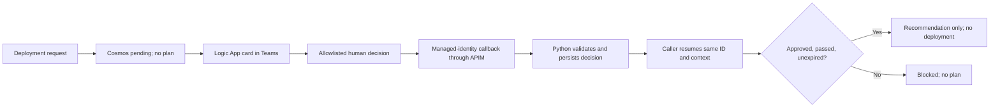

# Next-best-action approval flow: deployment and validation

**2026-09-09: the deployment-request approval round trip passed on AKS.**

The live test created one synthetic request, returned pending without a plan,
waited for the authorized user to approve its card in Teams, verified the real
managed-identity callback, and resumed the same request to obtain a recommendation.
The test did **not** execute the recommended plan, forge a callback, or automate
the human approval.

## Verified deployment

| Component | Verified value/status |
| --- | --- |
| Environment | `dev`, resource group `rg-dev`, East US 2 |
| AKS workload | `aks-amotbcj3zss6m`, namespace/deployment `mcp-agents`, two ready Python replicas |
| Image tag | `cramotbcj3zss6m.azurecr.io/mcp-agents:approval-c13c97f-20260909` |
| Deployed image digest | `sha256:4864f1ccc0af26c678290f5b02424855375112b667249f6570069e57a386b9bb` |
| Workflow | `logic-approval-amotbcj3zss6m`, Enabled |
| Teams OAuth connection | `logic-approval-amotbcj3zss6m-teams`, Connected after manual authorization in external Edge |
| Human decision surface | Private **Agents365 Approvals** team, standard **Approvals** channel, Microsoft Workflows app installed |
| Public callback | `https://apim-lciya4wh6qefy.azure-api.net/agent-approvals/callback` |
| Private callback | APIM rewrites to the authenticated Python `/approvals/callback` route |
| Durable storage | Cosmos `mcpdb/approvals`, partition key `/environment` |

The image was pushed through ACR's private endpoint from a temporary unprivileged
transfer pod, then deployed by digest. No public-registry access or firewall
exception was enabled. The transfer pod and its temporary registry credentials
were deleted. Existing workload identity, model, and storage settings were
preserved. The rollout used a startup probe and kept existing replicas available.

Non-secret deployment settings were saved in the local azd `dev` environment,
including `MCP_AGENT_RUNTIME=python` and `APPROVAL_LOGIC_APP_ENABLED=true`.
The signed `LOGIC_APP_APPROVAL_WEBHOOK` remains in a Kubernetes Secret, not azd
environment values, source, or generated manifests. Agent Identity remained
disabled: this deployment uses the existing workload-identity bootstrap UAMI.

## Live evidence

| Check | Observed result |
| --- | --- |
| Built-image startup, without network | Main imports, authenticated callback is mounted, missing approval config blocks deployment planning |
| AKS `/health` | HTTP 200 |
| Callback without a bearer token, on AKS and APIM | HTTP 401 at both layers |
| Python online preflight | Published `next_best_action` schema exposes `approval_id`; no mutation |
| Synthetic initiation | `approval_pending`, no plan; correlation state saved exclusively |
| Teams action | Waiting, then Succeeded after the user's real approval |
| Signed decision callback | `Send_Decision_Callback` Succeeded; overall Logic App run Succeeded |
| Cosmos record | `decision=approved`, `agent_validation=passed`, allowlisted human/tenant, original request hash |
| Python `--resume --expect approved` | Exit 0: approved, passed, unexpired; plan returned but not executed; saved state unchanged |

Successful request correlation (timestamps UTC):

- Approval ID: `f7051545-f59d-456b-a5a0-9c8bca0ddf30`.
- Synthetic test ID: `7e783e1d-633e-429e-9f81-b20588f2aec2`.
- Logic App run: `08584126340202815712477980806CU13`.
- Requested: `2026-09-09T16:54:24.970920Z`.
- Workflow completed: `2026-09-09T17:02:42.251039Z`.
- Approval expires: `2026-09-09T18:54:24.970920Z`; do not reuse after expiry.

The human approved **in Teams**, not via a test flag or chat answer. The test
used an owned loopback-only Kubernetes tunnel; intermittent local connectivity
required reconnecting to a verified healthy pod. No resume request was sent
while tunnel readiness failed. The successful test's tunnel was closed afterward.

### Failure-path evidence and runtime discoveries

An earlier request, `5a1bec23-e503-431b-bff2-166f9a1a3434`, exposed two transport
issues not caught by source-only tests:

1. Azure rejects `pattern` and `patternProperties` in **both** validated Request
   triggers and `ParseJson` actions. The workflow now uses supported bounded
   schemas, mandatory boolean checks, and whole-URL equality for its fixed HTTPS
   callback route. Python still performs authoritative GUID/hash verification.
2. The old Flow bot path returned 404. The actual East US 2 connector export
   (`managedApis/teams?api-version=2016-06-01&export=true`) defines
   `/v1.0/teams/conversation/gatherinput/poster/Flow%20bot/location/Channel/$subscriptions`.
   `notificationUrl` is top-level; `recipient`, `messageBody`, and `updateMessage`
   belong inside `body`.

The first run stopped before outbound activity. A single operator recovery of
its exact stored request was attempted after verifying no prior card/callback;
it preserved ID, hash, and expiry. The connector 404 then exercised the **real
failure callback**, leaving that request terminal `error/failed`. It was not
reset or used to authorize anything. The successful test used a new request
after the connector fix. Routine `resume_approval()` never redispatches a card.

Live rejection, timeout, replay races, and malicious-token cases were not all
repeated against Teams. They are covered by the offline suite; do not confuse
that coverage with a claim that every negative case was tested live.

## Enforcement scope and trust boundaries

- The [framework tool](../src/next_best_action_agent.py#L1061) delegates to the
  MCP implementation. Both use the [shared approval checkpoint](../src/next_best_action_agent.py#L1072)
  before embeddings, planning, or task/plan writes.
- `requires_approval()` detects deployment/CI-CD wording. This is **not blanket
  approval for all recommendations or all other tools**. Supplying an existing
  approval ID always revalidates its context, even if the task wording changes.
- Only a durable, matching, unexpired `approved/passed` **resume**, with a
  confirmed notification, permits planning. Rejected, pending, timeout, error,
  bad configuration, missing support, and corrupt context remain blocked.
- The request hash binds the exact task and trusted service/deployment context,
  including image and commit. Do not change this context between request and
  resume. It does not bind a model-generated plan that does not yet exist.
- This is a custom Logic Apps/Teams approval workflow associated with the agent,
  not automatic enforcement conferred by agent registry enrollment.
- Callback JWTs are pinned to the hosting tenant by APIM and Python, and to the
  Logic App **system principal** and dedicated callback audience. No Graph
  permissions or client password were added to the callback app.
- `APPROVAL_APPROVER_TENANT_ID` separately pins the Teams human tenant. Cross-tenant
  routing was explicitly approved for this lab; it does not relax callback JWT
  validation or bypass either tenant's consent policies. The Teams OAuth identity
  comes from manual user sign-in; responder identity comes from the connector
  envelope, never editable card fields or unsigned proxy headers.
- Use a standard channel inside a restricted private team. The first channel
  response completes the card, so the backend allowlist is not a substitute for
  restricting who can consume the card.

## Reproduce offline

The final comprehensive run passed **388 tests and 269 subtests**, with two skipped
platform-specific cases and five warnings. The known-gap XFAIL markers were
removed; enforcement assertions must pass. Use the existing virtual environment:

```powershell
.\.venv\Scripts\python.exe -m pytest tests/test_agent365_approval_unit.py tests/test_approval_callback_unit.py tests/test_approval_infra_unit.py tests/test_next_best_action_approval_wiring.py tests/test_approval_deployment_wiring_unit.py tests/test_online_approval_script_unit.py -q -p no:cacheprovider --tb=short
```

Do not substitute full test discovery: other repository tests contact live
services. The wiring tests execute isolated real handler bodies with fake model
and storage dependencies. Callback tests verify real RSA signatures against fake
JWKS. Infrastructure source checks supplement, but do not replace, actual Azure
deployment and connector runtime tests.

Both scoped and parent Bicep templates compile; the parent has 63 outputs, below
ARM's 64-output limit. The local `dev` configuration passes the helper's read-only
check. Both postprovision hooks were syntax-checked without running deployment
commands; the Bash check used Git's LF-normalized Linux representation.

## Repeat the online test intentionally

Use [scripts/test_online_agent365_approval.py](../scripts/test_online_agent365_approval.py).
The default `--preflight` sends only `tools/list`. Use the complete MCP message URL,
not the service root or SSE URL. HTTPS is required unless a **literal loopback**
HTTP address is explicitly permitted for an existing local Kubernetes tunnel.

```powershell
# In a separate terminal; bind only to the local machine.
kubectl --context aks-amotbcj3zss6m-admin -n mcp-agents port-forward --address 127.0.0.1 service/mcp-agents 18001:80
```

```powershell
$endpoint = 'http://127.0.0.1:18001/runtime/webhooks/mcp/message'
$state = Join-Path $env:TEMP ('agent365-approval-' + [guid]::NewGuid().ToString() + '.json')
.\.venv\Scripts\python.exe scripts/test_online_agent365_approval.py --endpoint $endpoint --allow-localhost --preflight

# Explicitly creates ONE synthetic request and can notify real Teams users.
.\.venv\Scripts\python.exe scripts/test_online_agent365_approval.py --endpoint $endpoint --allow-localhost --initiate --state-file $state

# Review the actual card in Teams. Only after a human approval:
.\.venv\Scripts\python.exe scripts/test_online_agent365_approval.py --endpoint $endpoint --allow-localhost --resume --state-file $state --expect approved
```

Keep the same endpoint, state, task, and server context for resume. Use
`--expect pending`, `rejected`, `timeout`, or `error` for the corresponding blocked
outcome. The CLI neither polls nor fabricates callback tokens. If initiation has
an uncertain result, preserve its state reservation and reconcile Cosmos/Logic
App history—**do not blindly initiate again**. Stop the owned tunnel when finished.
For HTTPS MCP access, credentials come only from process environment variables;
never paste tokens, keys, or signed URLs in chat or command arguments.

## Deployment and visualization artifacts

- [infra/approvals.bicep](../infra/approvals.bicep): scoped incremental deployment
  against existing Cosmos/APIM; stage disabled before human connector authorization.
- [infra/main.bicep](../infra/main.bicep) groups its non-secret approval outputs
  in `APPROVAL_RUNTIME_CONFIG` to stay within ARM's 64-output limit. The hooks
  and runtime helper accept this object/JSON string or legacy individual values.
- [scripts/configure_approval_runtime.py](../scripts/configure_approval_runtime.py):
  validates settings, fetches the signed trigger in memory, and applies Secret
  and ConfigMap without exposing the webhook.
- [Canonical workflow and Adaptive Card](../agent365/workflows/agent_approval_logic_app.json).
- [Exported Mermaid activity diagram](AGENTS_APPROVAL_FLOW.mermaid).

If an existing connection has been authorized, update only the workflow when
changing its definition/routing. Consumption Logic Apps rejects property updates
through `PATCH`; use the workflow `PUT` with its existing identity and trusted
parameters. Avoid overwriting the separate Teams connection's saved authorization.

