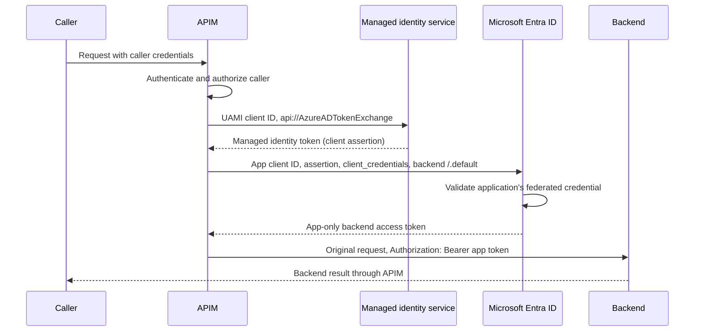

# APIM Managed Identity Token Exchange

The [policy fragment](../infra/app/apim-oauth/managed-identity-token-exchange.policy.xml)
shows how APIM uses an attached **user-assigned managed identity (UAMI)** as a
federated credential for a Microsoft Entra application. No client secret or
certificate is needed. The resulting backend token represents the **application**,
not the managed identity or the incoming user.

This is app-only `client_credentials` with a federated client assertion, not
on-behalf-of (OBO), delegated user authentication, or the RFC 8693 token-exchange
grant. If the backend should authorize the UAMI itself, use
`authentication-managed-identity` directly with the backend's resource audience;
that simpler case does not need an app registration or this exchange.



## 1. Configure Identity and Trust

The [APIM resource module](../infra/core/apim/apim.bicep) already creates and
attaches a UAMI, named `entra-app-user-assigned-identity` by default. Check
**APIM > Managed identities > User assigned** to confirm that identity is attached
to the target instance. This is separate from the AKS workload identity and
APIM's system-assigned identity.

The [OAuth module](../infra/app/apim-oauth/oauth.bicep) supplies these APIM named
values. References in the fragment use the **display names**, including their case:

| Named Value Display Name | Required Value |
| --- | --- |
| `EntraIdFicClientId` | Application (client) ID of the UAMI attached to APIM. The existing named-value resource ID is spelled `EntraIDFicClientId`. |
| `EntraIDClientId` | Application (client) ID of the Entra app that will authenticate to the backend. |
| `EntraIDTenantId` | Tenant ID containing both the UAMI and the Entra app. |

Supply a real app client ID through the top-level `existingEntraAppId` Bicep
parameter. The existing fallback ID is not evidence that an app or trust has been
provisioned. These named values are shared with OAuth: changing them also affects
that flow, so use a test environment for an isolated demonstration.

On that **app registration**, open **Certificates & secrets > Federated
credentials > Add credential**, select the **Managed Identity** scenario, and
select APIM's UAMI. The equivalent credential has this shape; replace both
uppercase placeholders with your actual IDs:

```json
{
  "name": "apim-uami-token-exchange",
  "issuer": "https://login.microsoftonline.com/TENANT_ID/v2.0",
  "subject": "UAMI_PRINCIPAL_ID",
  "audiences": ["api://AzureADTokenExchange"]
}
```

The subject is the UAMI's **Object (principal) ID**, not its client ID and not the
app's object ID. Create the credential on the app, not on the UAMI. An authorized
application owner or administrator must configure this trust.

Grant the **application's service principal** only the backend permissions it
needs. For the Graph demonstration below, the least-privileged application
permission is `Organization.Read.All`, with administrator consent. Delegated
`User.Read` permissions or permissions granted only to the UAMI are insufficient.
For an Azure service, assign the appropriate resource-scoped RBAC role to the
application's service principal instead.

The current [Entra app module](../infra/app/apim-oauth/entra-app.bicep) only returns
an existing app ID. **It does not create the federated credential or grant backend
permissions.** Deploying the fragment does neither of those things.

This example targets Azure public cloud and one tenant. Sovereign clouds require
the corresponding authority, token-exchange audience, and backend endpoints.

## 2. Add the Fragment to APIM

Normal Bicep deployment, including the Terraform wrapper, now creates a policy
fragment named `managed-identity-token-exchange`. It does not include the fragment
in any API policy or change the existing OAuth endpoints.

To add just the fragment to an existing instance without redeploying the full
environment, open **APIM > APIs > Policy fragments > Create**, use that name, and
paste the [canonical XML](../infra/app/apim-oauth/managed-identity-token-exchange.policy.xml),
including its `<fragment>` wrapper. Verify the three named values above first.

## 3. Use It on a Protected Operation

For an isolated demonstration, create an HTTPS API with suffix
`token-exchange-demo` and a single `GET /organization` operation. Require an
API-scoped subscription for this demo, restrict its distribution, and retain any
required JWT validation and caller authorization policies. Do not expose a
wildcard Graph proxy or attach this to the public OAuth endpoints.

Append these statements to the operation's **inbound** section, after `<base />`
and successful caller authorization. Preserve the rest of the existing policy:

```xml
<set-backend-service base-url="https://graph.microsoft.com/v1.0" />
<rewrite-uri template="/organization" copy-unmatched-params="false" />
<set-query-parameter name="$select" exists-action="override">
    <value>id,displayName</value>
</set-query-parameter>
<set-header name="Ocp-Apim-Subscription-Key" exists-action="delete" />
<set-variable name="tokenExchangeScope" value="https://graph.microsoft.com/.default" />
<include-fragment fragment-id="managed-identity-token-exchange" />
```

`tokenExchangeScope` must be a single resource's `/.default` scope, configured by
the policy author. Do not derive the scope, app ID, tenant, or backend URL from
request headers, query parameters, or body content. For your own API, configure
its application ID URI plus `/.default` and its fixed HTTPS backend instead.
Check the effective policy to ensure no later routing or authentication policy
changes the intended destination or replaces the exchanged token.

The fragment authenticates **APIM to the backend**, not the caller to APIM. Every
authorized caller uses the same application's backend permissions. Authenticate
and authorize callers before the exchange; do not use this flow where backend
authorization must preserve the user's identity.

## 4. Observe and Verify

The fragment first obtains a UAMI token for `api://AzureADTokenExchange`, then
sends a separate form-encoded POST to the tenant's `/oauth2/v2.0/token` endpoint.
The POST uses `mode="new"`, so it does not copy the incoming request's credentials
or body. It sends `client_id`, `grant_type=client_credentials`, `scope`,
`client_assertion_type`, and the UAMI token as `client_assertion`.

Only a successful response containing a nonempty bearer access token reaches the
final `Authorization` header assignment. The fragment does not alter the original
request method or body and does not return a token to the caller.

| Check | Expected Result |
| --- | --- |
| Call `GET /token-exchange-demo/organization` with valid caller credentials and configured trust/permissions | Graph returns HTTP 200 with organization ID and display name. |
| Omit required caller credentials | APIM rejects the caller before acquiring a backend token. |
| Omit `tokenExchangeScope`, use delegated scopes, or supply multiple scopes in an isolated test policy | HTTP 500 with `token_exchange_not_configured`; no backend request. |
| Use a mismatched federation configuration in an isolated test environment | HTTP 502 with `token_exchange_failed`; no backend request. |
| Entra times out, rejects the assertion, or returns a malformed/missing bearer token | HTTP 502 with `token_exchange_failed`; no backend request. |
| UAMI token acquisition fails | APIM enters its error pipeline; no backend request. Keep error policies fail-closed. |
| Graph returns HTTP 403 after a successful exchange | Verify application permission/admin consent, not just federation trust. |

Use Entra workload sign-in records and backend authorization results to verify
which application was used. For an API you own, its validated identity metadata
should identify the Entra application's service principal, not the UAMI. Treat
tokens for Microsoft APIs as opaque.

Do not log or return the assertion, token response, or backend Authorization
header. Avoid echo backends. APIM debug traces can reveal policy variables and
`send-request` bodies even though this fragment contains no `trace` statements;
restrict trace access and redact credentials from diagnostics.

APIM caches the managed identity assertion through its built-in policy. This
teaching fragment deliberately requests a fresh application token per invocation;
it does not implement an application-token cache. Review token caching, expiry
skew, throttling, and load before production use.

## Local Checks

```powershell
python -m pytest tests/test_apim_token_exchange_unit.py -q -p no:cacheprovider
az bicep build --file infra/main.bicep --outfile "$env:TEMP\azure-agents-main-token-exchange.json"
```

The tests check XML, source wiring, failure guards, and the documented example.
Bicep compilation checks deployment structure. Neither executes APIM's C#
expressions nor proves live federation or backend access; run the protected
operation checks above after deploying and configuring trust.

## References

- [APIM managed identity policy](https://learn.microsoft.com/azure/api-management/authentication-managed-identity-policy)
- [Configure an app to trust a managed identity](https://learn.microsoft.com/entra/workload-id/workload-identity-federation-config-app-trust-managed-identity)
- [Client credentials with a federated credential](https://learn.microsoft.com/entra/identity-platform/v2-oauth2-client-creds-grant-flow#third-case-access-token-request-with-a-federated-credential)
- [APIM policy fragments](https://learn.microsoft.com/azure/api-management/policy-fragments)
- [Microsoft Graph organization permissions](https://learn.microsoft.com/graph/api/organization-list?view=graph-rest-1.0)