# Lab Manual: Build Your Own Agent with Azure Agents Control Plane, GitHub Copilot and SpecKit

## Overview

This lab guides you through creating a new AI agent using Azure as the secured, managed and governed control plane and GitHub Copilot - SpecKit to realize your new agent. Using the **SpecKit methodology** for specification-driven development, you will review the project constitution to understand governance principles, then write your agent specification and deploy to Azure Kubernetes Service (AKS) as a new pod.

**Duration**: 4 hours  
**Prerequisites**: Completed environment setup and deployed the base Azure Agents Control Plane infrastructure

---

## Exercises

| Exercise | Duration | Description |
|----------|----------|-------------|
| [Exercise 1: Lab Intro](exercises/exercise_01_lab_intro.md) | 30 min | Review objectives, architecture, validate environment |
| [Exercise 2: Build Agents](exercises/exercise_02_build_agents.md) | 2 hr | Use GitHub Copilot and SpecKit to specify, create, test, and deploy agents |
| [Exercise 3: Review Agents Control Plane](exercises/exercise_03_review_agents_control_plane.md) | 30 min | Inspect security, governance, memory, and observability. |
| [Exercise 4: Optimize and Evaluate Agent](exercises/exercise_04_optimize_and_evaluate_agent.md) | 1 hr | Evaluate baseline, optimize with the Azure Agents Learning SDK, re-evaluate to validate improvement |

---

## Introduction

### What is the Azure Agents Control Plane?

The Azure Agents Control Plane is a comprehensive solution accelerator that secures, governs a control plane for agents. The following solution architecture diagram depicts the Azure Agents Control Plane runtime architecture:

### Why Azure as the Enterprise Control Plane?

Traditional AI agent frameworks and architectures focus on getting something working quickly. However, enterprise deployments require:

- **Centralized Governance** - Policy enforcement, rate limiting, decision making approvals and a registry for compliance tracking
- **Security** - Threat protection, secret management, network isolation, and credential administration for all agent workloads
- **Identity-First Security** - Every agent has a Microsoft Entra ID Agent identity with Role-Based Access Control (RBAC)
- **API-First Architecture** - All agent operations flow through Azure API Management (APIM) using Model Context Protocol (MCP)
- **Multi-Cloud Capable** - Agents can execute anywhere while being governed by Azure
- **Continuous Improvement** - Built-in evaluations and in-process reinforcement learning
- **Human Oversight** - Agent 365 integration for human-in-the-loop workflows

---

## Table of Contents

1. [Exercises](#exercises)
2. [Lab Objectives](#lab-objectives)
3. [Exercise 1: Lab Intro](exercises/exercise_01_lab_intro.md)
4. [Exercise 2: Build Agents](exercises/exercise_02_build_agents.md)
5. [Exercise 3: Review Agents Control Plane](exercises/exercise_03_review_agents_control_plane.md)
6. [Exercise 4: Optimize and Evaluate Agent](exercises/exercise_04_optimize_and_evaluate_agent.md)
7. [Optional Exercises](#optional-exercises)

---

## Lab Objectives

By the end of this lab, you will be able to:

### Build Your Agent
- ✅ Review the SpecKit constitution and understand governance principles for your software development lifecycle
- ✅ Write a detailed specification for your agent by following the SpecKit methodology
- ✅ Integrate with the Azure Agents Control Plane infrastructure as follows:
  - ✅ Implement an MCP-compliant agent using FastAPI
  - ✅ Containerize your agent with Docker
  - ✅ Deploy your agent to AKS as a new pod

### Enterprise Governance
- ✅ Understand how Azure API Management acts as the governance gateway
- ✅ Inspect APIM policies that enforce rate limits, quotas, and compliance with enterprise standards
- ✅ Trace requests through the control plane using distributed tracing

### Security & Identity
- ✅ Configure identity for agents running in AKS pods
- ✅ Implement least-privilege RBAC for agent resources and tooling access
- ✅ Validate keyless authentication patterns

### Observability
- ✅ Monitor agent behavior using Azure Monitor and Application Insights
- ✅ Query telemetry with Kusto Query Language (KQL)

### Learning & Evaluation
- ✅ Establish baseline evaluation scores before learning
- ✅ Capture agent episodes for training data collection
- ✅ Produce rewards from Azure AI Evaluation judges or manual labels
- ✅ Optimize agent behavior with the Azure Agents Learning SDK (in-process reinforcement learning)
- ✅ Re-evaluate after learning to measure improvement
- ✅ Apply decision gates (keep, re-learn, or collect more data) based on eval results
- ✅ Run structured evaluations measuring intent resolution, tool accuracy, and task adherence

---

## Getting Started

To begin the lab, proceed to **Exercise 1: Lab Intro** which will be used to introduce the solution architecture and to verify your environment. 

**[Start Exercise 1: Lab Intro →](exercises/exercise_01_lab_intro.md)**

---

## Exercise Summaries

### Exercise 1: Lab Intro (30 minutes)

Review objectives, architecture, and validate your environment is ready.

**Key Activities:**
- Review lab objectives and solution architecture
- Understand the Azure Agents Control Plane
- Run test(s) to confirm environment works

**[Full Exercise →](exercises/exercise_01_lab_intro.md)**

---

### Exercise 2: Build Agents (1 hour)

Use GitHub Copilot and SpecKit to specify, create, unit test, deploy and functionally test your agent(s).

**Key Activities:**
- Review the project constitution
- Use Copilot for specification, implementation, and testing
- Build an **Autonomous Agent** that operates without human intervention
- Deploy agent(s) to AKS in a single pod

**[Full Exercise →](exercises/exercise_02_build_agents.md)**

---

### Exercise 3: Review Agents Control Plane (30 minutes)

Inspect security, governance, memory, and observability.

**Key Activities:**
- Check APIM policies (rate limiting, MCP, OAuth, quotas)
- Check Cosmos DB for chat, plans, tasks, sessions and episodes
- Check AI Foundry/AI Search for long-term memory
- Check Fabric IQ/Storage for ontologies
- Check Log Analytics and App Insights for observability
- Check Entra ID/RBAC for identity
- Identify any problems with your agents

**[Full Exercise →](exercises/exercise_03_review_agents_control_plane.md)**

---

### Exercise 4: Optimize and Evaluate Agent (1 hour)

Establish baseline evaluations, optimize with the Azure Agents Learning SDK, re-evaluate to validate improvement.

**Key Activities:**
- Prepare evaluation dataset and run baseline evaluation
- Enable episode capture and generate training data
- Produce rewards from the Azure AI Evaluation judges or manual labels
- Initialize a softmax policy over discrete action choices
- Run an in-process REINFORCE learning batch and inspect the policy
- Re-run evaluations and compare before/after scores
- Apply decision gate: keep, re-learn, or collect more data
- Store evaluation results for historical tracking

**[Full Exercise →](exercises/exercise_04_optimize_and_evaluate_agent.md)**

---
